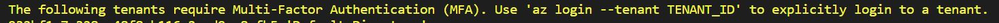
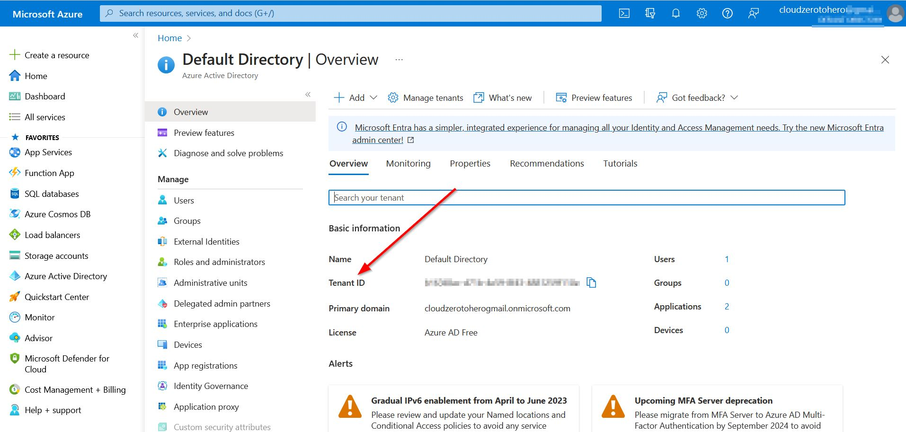
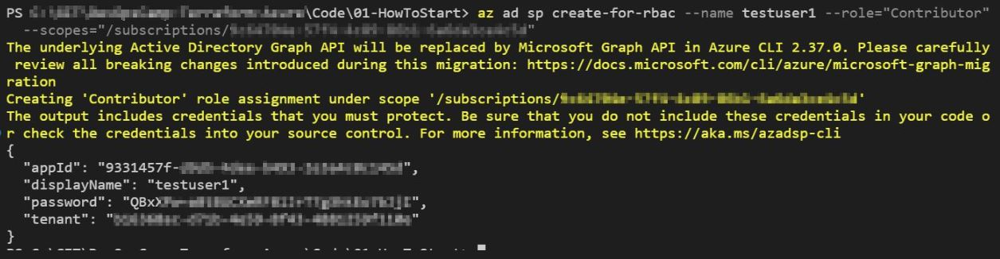
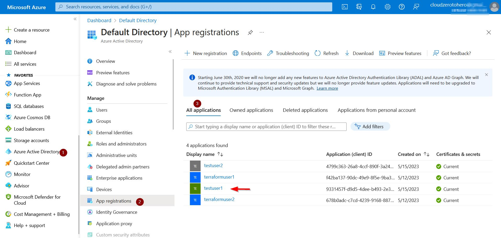
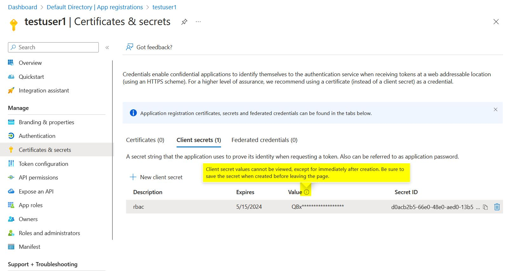

# How to start with Terraform on Azure 

The official Terraform manual available there is a great source of knowledge to start with:
> https://learn.hashicorp.com/tutorials/terraform/azure-build


## Prerequisites 

At this stage seems fair to assume that I have terraform installed (but if not - I can do it following another tutorial -> https://learn.hashicorp.com/tutorials/terraform/install-cli?in=terraform/azure-get-started ).

Second assumption is that I have a Azure account (which is true :smile:). And my account is protected with MFA.


## Azure CLI

### Install

Whole process is described there:
> https://docs.microsoft.com/en-us/cli/azure/install-azure-cli

which as a matter fact is just as simple as download file and run it (at least on Windows)

### Update

While I installed Azure CLI a while ago, it is good ides to check if there are any updates.
First I can check what version I currently use 
``` azure cli
az --version
```

Because this command will not only checked what CLI version I have, but also told me I have few updates available, I decidec to update CLI with

```
az upgrade 
```
Just a few clicks and I heve newest version is installed 

## Azure PowerShell

Complete manual is available there:
> https://learn.microsoft.com/en-us/powershell/azure/install-azure-powershell?view=azps-10.1.0

Taking a shortcut - just type these two cammands
``` powershell
Set-ExecutionPolicy -ExecutionPolicy RemoteSigned -Scope CurrentUser
Install-Module -Name Az -Repository PSGallery -Force
```

And - for future reference - to update Azure PowerShell module:
``` powershell
Update-Module -Name Az
```

## Connect Terraform to Azure

 ### Login to Azure with user credentials

 This is the simplest way to "tell" Terraform how to interact with Azure. With Azure CLI installed I can login o my Azure account with 
```
az login
```
or with PowerShell command

``` powershell
Connect-AzAccount
```

Or I should rather say "I should be able to login". But in case of my account I encountered following error

Fortunately Terraform also provided me with IDs of my tenant, so it was easy to solve this problem.

I can always find my tenant ID through portal e.g. on Azure Active Directory page


### Manually select subscription

When login completes, all available subscription are listed on the terminal screen. 


If I ever forget my tenant ID, it is easy to get this information with command:
```
az account show
``` 
or 
``` powershell
Get-AzTenant | fl
```

I can list my subscriptions with 
```
az account list
```
or with PowerShell
``` powershell
Get-AzSubscription
```

And I can select an subscription to which I want to deploy resources

```
az account set --subscription "<subscription_ID_or_name>"
```
which in my case is
```
az account set --subscription "cloudZeroToHero"
```

With PowerShell this process looks a bit different
``` powershell
$context = Get-AzSubscription -SubscriptionName "<name-of-your-subscription>"
# in my case 
# $context = Get-AzSubscription -SubscriptionName  "cloudzerotohero"
#
# this can also be done with
# $context = Get-AzSubscription -SubscriptionId "<ID-of-your-subscription>"
#
# while I have selected subscription I can set context

Set-AzContext $context
```

### Hardcode susbscription

Other possibility is to include subscription ID in azure_rm provider block:
``` 
provider "azurerm" {
  features {}
  # put subscription ID instead of zeros
  subscription_id = "00000000-0000-0000-0000-000000000000"

}

```
In theory it is also possible to include tennat ID in the definition. But even though the tennant ID was completelly wrong, I was still able to deploy resources... For now - I don't know why.
```
provider "azurerm" {
  features {}
  
  # subscription_id = "00000000-0000-0000-0000-000000000000"
  tenant_id = "00000000-0000-0000-0000-000000000000"
}
```

### Connect with Service Principal

I would say that in that case we can think of Service Principal as a kind of service acoount. It feels and seems like an application registration, but it is not. At least that helps me to deal with this concept.

#### Service Principal with Azure CLI
It is possible to create Sevice Principal from command line. Both --role="Contributor" and --scopes are necessary to assign role to a newly create object. 
By default (without these parameters) command will create user, but without any role assigned
```
az ad sp create-for-rbac --name <user_name> --role="Contributor" --scopes="/subscriptions/<SUBSCRIPTION_ID>"
```

Output:


And this was the last time I saw this password :sweat:
Oh well, I thought it is possible to find it throug portal:

No - I cannot:


But from the screen we can find that by default user password has a 1 yer expiration date. It is possible to extend expiration period by specifying --years value when user is created.


#### Service Principal with Azure PowerShell

Of course Microsoft provides proper manual:
> https://learn.microsoft.com/en-us/powershell/azure/create-azure-service-principal-azureps?view=azps-10.2.0

To create servide principal I use this command:

``` powershell
$sp = New-AzADServicePrincipal -DisplayName <user_name>
```

Now I can find the password with 

``` powershell
 $sp.PasswordCredentials.SecretText
```

I can find what role is assigned to this service pricipal and on what scope
``` powershell
Get-AzRoleAssignment -ObjectID $sp.Id | select DisplayName,RoleDefinitionName,Scope
```

I can assign new role (in this case Contributor role)
``` powershell 
New-AzRoleAssignment -ObjectId $sp.Id -RoleDefinitionName "Contributor" -Scope "/subscriptions/<SUBSCRIPTION_ID>"
```

Or remove role assignments
``` powershell
Remove-AzRoleAssignment -ObjectId $sp.Id -RoleDefinitionName 'Contributor'
```

And in case I forget service principal name I can find it
``` powershell
Get-AzADServicePrincipal -DisplayNameBeginsWith "test"
```

#### How to login with service principal using password

``` powershell
# Use the application ID as the username, and the secret as password
$credentials = Get-Credential
Connect-AzAccount -ServicePrincipal -Credential $credentials -Tenant <tenant ID>
```
For convieniece I wrote all the commansd to sepatate file
> https://github.com/cloudZeroToHero/DevOpsCamp-Terraform-Azure/blob/main/Code/00-Prerequisites-and-login/Login-to-AZ.ps1


#### How to login with environmental variables

Once Service Principal is created we can add environmnetal varialbes (all four of them) to be used during authentication
```
$Env:ARM_CLIENT_ID = "<APPID_VALUE>"
$Env:ARM_CLIENT_SECRET = "<PASSWORD_VALUE>"
$Env:ARM_SUBSCRIPTION_ID = "<SUBSCRIPTION_ID>"
$Env:ARM_TENANT_ID = "<TENANT_VALUE>"
```

The only question is - how to manage these variables.
Each variable can be easly changed by providing new value
To list variables I use
``` powershell
Get-ChildItem env: | where name -like "ARM*"
```

And to delete any of them I use
``` powershell
Remove-Item -Path env:<variable_name>
```

The same way I can delete all ARM related variables
``` powerhsell
Get-ChildItem env: | where name -like "ARM*" | Remove-Item
```

# Commands

All the commands are available here
> https://github.com/cloudZeroToHero/DevOpsCamp-Terraform-Azure/blob/main/Code/00-Prerequisites-and-login/Login-to-AZ.ps1

# Sources
Build Infrastructure - Terraform Azure Example
> https://developer.hashicorp.com/terraform/tutorials/azure-get-started/azure-build


Proper Terraform Authentication for Azure Deployments
> https://www.youtube.com/watch?v=MfXHZOqkzuE

Create an Azure Active Directory application and service principal that can access resources
> https://learn.microsoft.com/en-us/azure/active-directory/develop/howto-create-service-principal-portal

az ad sp create-for-rbac - command manual
> https://learn.microsoft.com/en-us/cli/azure/ad/sp?view=azure-cli-latest#az-ad-sp-create-for-rbac

Poweshell - Create a service principal
> https://learn.microsoft.com/en-us/powershell/azure/create-azure-service-principal-azureps?view=azps-10.2.0