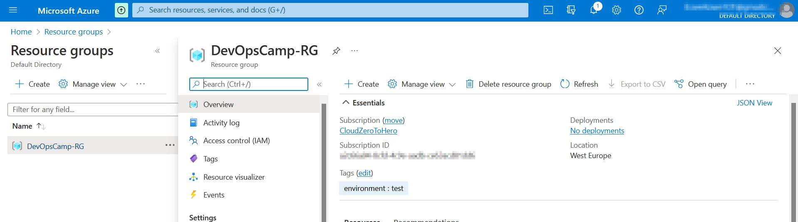

# How to start with Terraform on Azure 

The official Terraform manual available there is a great source of knowledge to start with:
> https://learn.hashicorp.com/tutorials/terraform/azure-build


# Prerequisites 

At this stage seems fair to assume that I have terraform installed (but if not - I can do it following another tutorial > https://learn.hashicorp.com/tutorials/terraform/install-cli?in=terraform/azure-get-started ).

Second assumption is that I have a Azure account (which is true :smile:)
The only difference is - my account is protected by MFA 


# How to install Azure CLI

Whole process is described there:
> https://docs.microsoft.com/en-us/cli/azure/install-azure-cli

With CLI installed I can login o my Azure account with 
```
az login
```
or I should rather say "I should be able to login". But in case of my account I encountered following error

Fortunately Terraform also provided me with IDs of my tenant, so it was easy to solve this problem.


## First "apply"

I wrote a simple terraform file (available there > https://github.com/cloudZeroToHero/DevOpsCamp/blob/main/Terraform-Azure/Code/ResourceGroup/main.tf) and run **terraform apply**

And the result was as expected - resource group with assigned tags 



