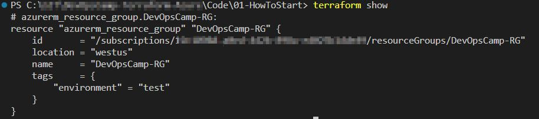
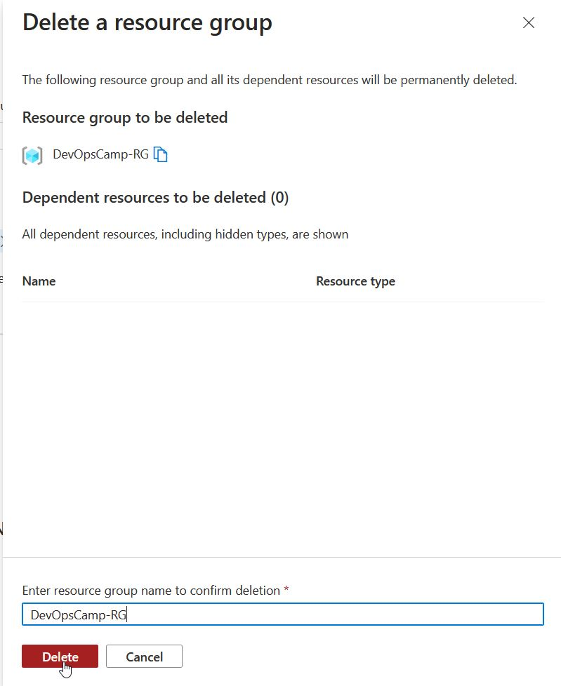
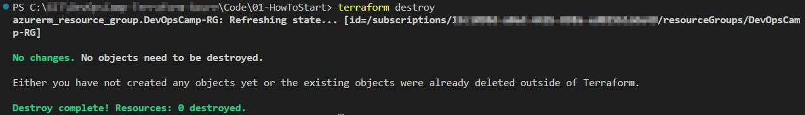

# Before deploy
Base on official manual I wrote a simple terraform file (available there > https://github.com/cloudZeroToHero/DevOpsCamp/blob/main/Terraform-Azure/Code/ResourceGroup/main.tf)

Resource block defines componenst of my infrastructure - nothing fancy, just a resource group.
``` hcl
resource "azurerm_resource_group" "DevOpsCamp-RG" {
  name     = "DevOpsCamp-RG"
  location = "westus"
  tags = {
    environment = "test"
  }
}
```

And just to make it clear what is what in this definition:
```
resource "azurerm  _  resource_group" "DevOpsCamp-RG"
               |              |        |
              provider    resource    name
                     |  +   |          |
                   resource type       |
                             |    +    |
                             resource ID

```


# First "apply"

And all of that was just to authenticate agains Azure. Time to really work with Terraform. OK - maybe "work" is too big word, but I have to start somewhere :wink:

 and run **terraform apply**

And the result was as expected - resource group with assigned tags 


# Terrafrom state

It is possible to check what Terraform "think" is deployed with 
```
terrafrom show
```

which procudes following output


Output does not change even if I manually delete resource group


But when I want to delete my deployment, terraform is able to recognize manual changes in deployment



# Ignore files

It was fairly easy to use GitHub to prepare .gitignore file for me.

Otherwise I would prepare it myself :wink:

One of the important files which is by default ignored (by GitHub template) is ***terraform.tfstate***
According to Terraform official manual (link below) this file "contains all of the data in your configuration and could also contain **sensitive values in plain text**, so do not share it or check it in to source control"

Thus this file should be first on the list to ignore.
And that is why this chapter is there - now I have this file !


# Sources
Build Infrastructure - Terraform Azure Example
> https://developer.hashicorp.com/terraform/tutorials/azure-get-started/azure-build

Proper Terraform Authentication for Azure Deployments
> https://www.youtube.com/watch?v=MfXHZOqkzuE

Create an Azure Active Directory application and service principal that can access resources
> https://learn.microsoft.com/en-us/azure/active-directory/develop/howto-create-service-principal-portal

az ad sp create-for-rbac - command manual
> https://learn.microsoft.com/en-us/cli/azure/ad/sp?view=azure-cli-latest#az-ad-sp-create-for-rbac

Poweshell - Create a service principal
> https://learn.microsoft.com/en-us/powershell/azure/create-azure-service-principal-azureps?view=azps-10.2.0