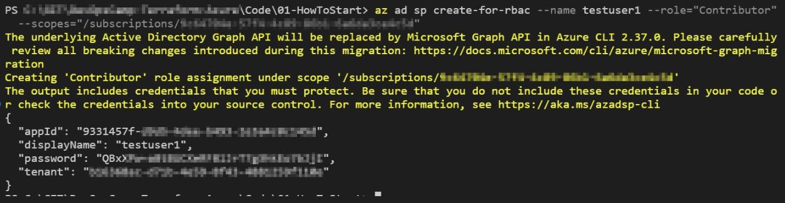
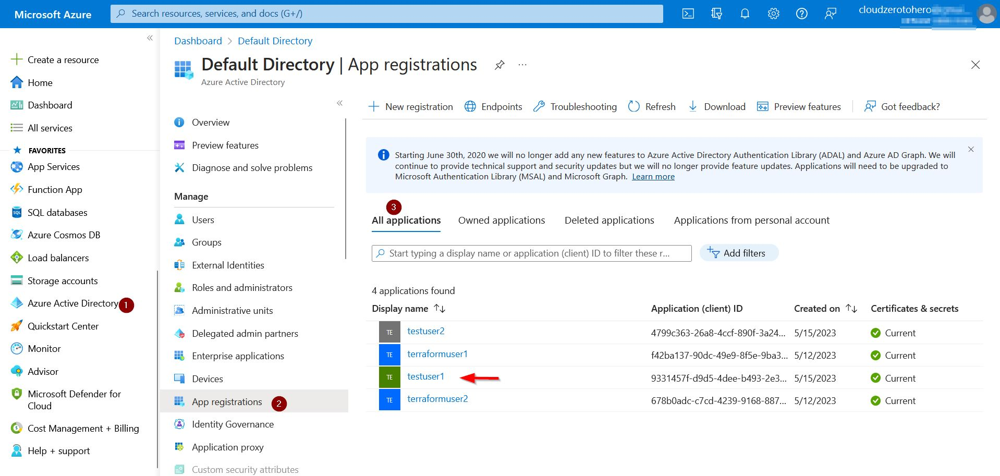

# How to start with Terraform on Azure 

The official Terraform manual available there is a great source of knowledge to start with:
> https://learn.hashicorp.com/tutorials/terraform/azure-build


## Prerequisites 

At this stage seems fair to assume that I have terraform installed (but if not - I can do it following another tutorial > https://learn.hashicorp.com/tutorials/terraform/install-cli?in=terraform/azure-get-started ).

Second assumption is that I have a Azure account (which is true :smile:)
The only difference is - my account is protected by MFA 


## How to install Azure CLI

Whole process is described there:
> https://docs.microsoft.com/en-us/cli/azure/install-azure-cli

## Connect Terraform to Azure

 ### Login to Azure with user credentials

 This is the simplest way to "tell" Terraform how to interact with Azure. With CLI installed I can login o my Azure account with 
```
az login
```
or I should rather say "I should be able to login". But in case of my account I encountered following error

Fortunately Terraform also provided me with IDs of my tenant, so it was easy to solve this problem.

When login completes all available subscription were listed on the terminal screen. 

If I ever forget my tenant id it is easy to get this information with command:
```
az account show
``` 
Or if I cannot login wiet CLI I can always find my tenant ID through portal e.g. on Azure Active Directory page


One additional feature is to include subscription ID in azure_rm provider block:
``` 
provider "azurerm" {
  features {}
  # put subscription ID instead of zeros
  subscription_id = "00000000-0000-0000-0000-000000000000"

}

```
In theory it is also possible to include tennat ID in the definition. But even though the tennant ID was completelly wrong, I was still able to deploy resources... For now - I don't know why.
```
provider "azurerm" {
  features {}
  
  # subscription_id = "00000000-0000-0000-0000-000000000000"
  tenant_id = "00000000-0000-0000-0000-000000000000"
}
```

### Connect with Service Principal

I would say that in that case we can think of Service Principal as a kind of service acoount. It feels and seems like an application registration, but it is not. At least that helps me to deal with this concept.


It is possible to create Sevice Principal from command line (of course it is necessary to insert subscription ID). Both --role="Contributor" and --scopes are necessary to assign role to a newly create object. 
By default (without these parameters) command will create user, but without any role assigned
```
az ad sp create-for-rbac --name <user_name> --role="Contributor" --scopes="/subscriptions/<SUBSCRIPTION_ID>"
```

Output:


And this was the last time I saw this password :sweat:
Oh well, I thought it is possible to find it throug portal:

No:


But from the screen we can find that by default user password has a 1 yer expiration date. It is possible to extend expiration period by specifying --years value when user is created.


Once new user is created we can add environmnetal varialbes (all four of them) to be used during authentication
$Env:ARM_CLIENT_ID = "<APPID_VALUE>"
$Env:ARM_CLIENT_SECRET = "<PASSWORD_VALUE>"
$Env:ARM_SUBSCRIPTION_ID = "<SUBSCRIPTION_ID>"
$Env:ARM_TENANT_ID = "<TENANT_VALUE>"


The only question is - how to manage these variables.

Each variable can be easly changed by providing new value

To list variables I use
``` powershell
Get-ChildItem env: | where name -like "ARM*"
```

And to delete any of them I use
``` powershell
Remove-Item -Path env:<variable_name>
```

The same way I can delete all ARM related variables
``` powerhsell
Get-ChildItem env: | where name -like "ARM*" | Remove-Item
```


## Before deploy
Base on official manual I wrote a simple terraform file (available there > https://github.com/cloudZeroToHero/DevOpsCamp/blob/main/Terraform-Azure/Code/ResourceGroup/main.tf)

Resource block defines componenst of my infrastructure - nothing fancy, just a resource group.
``` hcl
resource "azurerm_resource_group" "DevOpsCamp-RG" {
  name     = "DevOpsCamp-RG"
  location = "westus"
  tags = {
    environment = "test"
  }
}
```

And just to make it clear what is what in this definition:
```
resource "azurerm  _  resource_group" "DevOpsCamp-RG"
               |              |        |
              provider    resource    name
                     |  +   |          |
                   resource type       |
                             |    +    |
                             resource ID

```


## First "apply"

And all of that was just to authenticate agains Azure. Time to really work with Terraform. OK - maybe "work" is too big word, but I have to start somewhere :wink:

 and run **terraform apply**

And the result was as expected - resource group with assigned tags 


## Ignore files

It was fairly easy to use GitHub to prepare .gitignore file for me.

Otherwise I would prepare it myself :wink:

One of the important files which is by default ignored (by GitHub template) is ***terraform.tfstate***
According to Terraform official manual (link below) this file "contains all of the data in your configuration and could also contain **sensitive values in plain text**, so do not share it or check it in to source control"

Thus this file should be first on the list to ignore.

# Sources
Build Infrastructure - Terraform Azure Example
> https://developer.hashicorp.com/terraform/tutorials/azure-get-started/azure-build


Proper Terraform Authentication for Azure Deployments
> https://www.youtube.com/watch?v=MfXHZOqkzuE

Create an Azure Active Directory application and service principal that can access resources
> https://learn.microsoft.com/en-us/azure/active-directory/develop/howto-create-service-principal-portal

az ad sp create-for-rbac - command manual
> https://learn.microsoft.com/en-us/cli/azure/ad/sp?view=azure-cli-latest#az-ad-sp-create-for-rbac