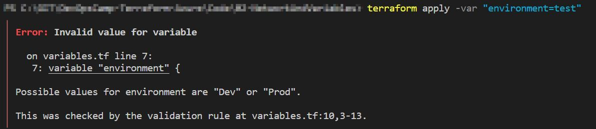
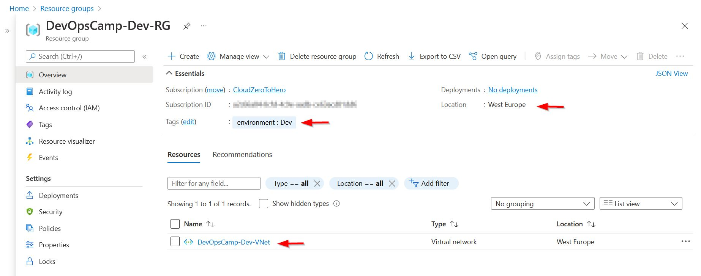
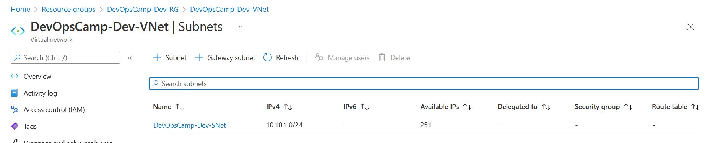
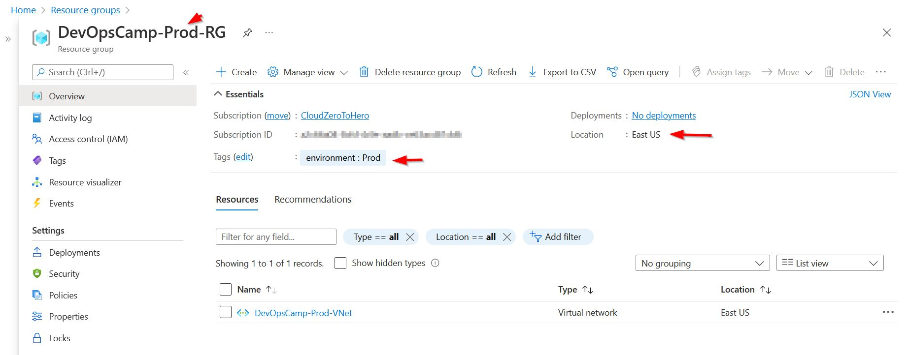

# Changes from previous module

I think that the keeping all the code in one file will be not a very good idea for a bigger project. So I decided to split main.tf to few smaller ones.

First one - terraform.tf will be used just to keep information related to provider, its versions, features etc.

Second file - infrastructure.tf will keep all the resources that are not compute-network-compute ones. \ 
At least this is plan for now. \
Resource group definition will be kept there.


# Variables

I thought it could be nice to be able to simulate situation when I use the same terraform file to deploy resources somehow differently base on some requirements. For example to be able to deploy Dev and Prod environment to different regions. Or be able to change part of the resource name during deployment. 

That is why I created variables.tf with three variables.

First is the ###project-name### which will be used to alter resource name \
Second is ###environment### - by changing this variable I will be able to deploy resources to different regions. This will be possible by use of the third variable ###az-region### which will map the selected environment to different region.

The initial idea was to use simple string type for the ###environment### variable
``` hcl
variable "environment" {
  type    = string
  default = "Dev"
}
```

But this would be so much error prone - I cannot assume that each time I will type the variable correctly. That is why the validation is required
``` hcl
variable "environment" {
  type    = string
  default = "Dev"
  validation {
    condition     = contains(["Dev", "Prod"], var.environment)
    error_message = "Possible values for environment are \"Dev\" or \"Prod\"."
  }
}
```

Now if I name the environment wrong - I will get an error message



# Network

Finally I can deploy something new :smile:

According to 
> https://docs.microsoft.com/en-us/azure/virtual-network/virtual-networks-overview
```
Virtual networks and subnets span all availability zones in a region. You don't need to divide them by availability zones to accommodate zonal resources.
```

That is great - I will need only one virtual network and only (for now) subnet.

File network.tf contains the network definition 

In code demonstrated in the official manual \
https://registry.terraform.io/providers/hashicorp/azurerm/latest/docs/resources/virtual_network \
subnet block is placed inside the virtual network definition. \
But according to the manual it is possible to create a subnet as a separate resource. I choose this approach.

Of course I used the variables to name and tag resources. Let's see how it looks on when deployed.


# Result

First - default deployment (environment = Dev)

Resource group was successfully deployed to proper region, with proper tags and with virtual network in it


Virtual network has a subnet


But am I able to deploy Proc environment ? \
(variables are case sensitive)

``` hcl
terraform apply -var "environment=Prod"

```

Yes - I am :smile:



Files are available here:
> https://github.com/cloudZeroToHero/DevOpsCamp-Terraform-Azure/tree/main/Code/02-VariablesAndNetwork
