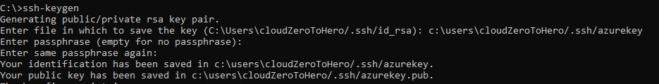
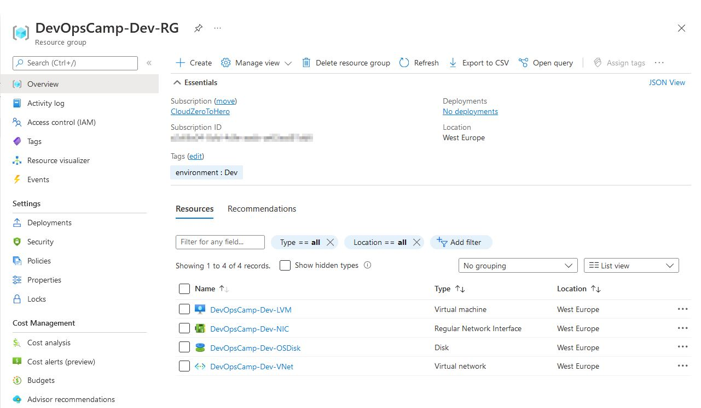
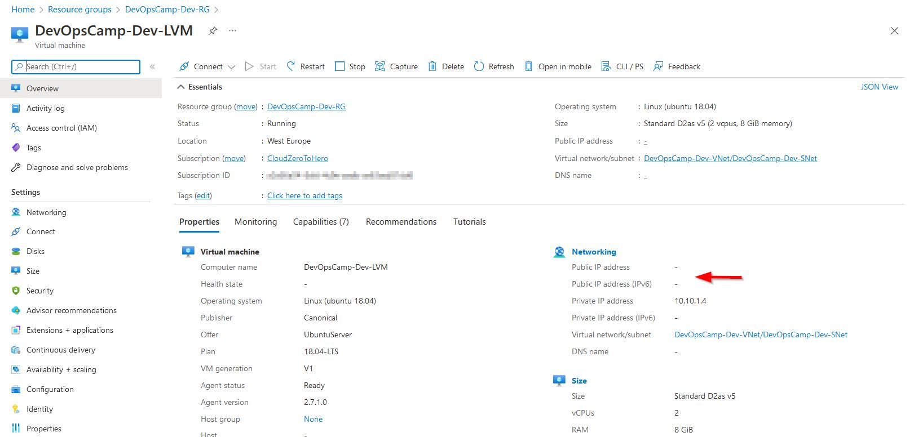

# Deploy a VM

There are few steps necessary to perform o deploy a VM in Azure. Or rather - it is necessary to deploy few additional resources to be able to deploy VM. \
On top of that according to 
> https://registry.terraform.io/providers/hashicorp/azurerm/latest/docs/resources/virtual_machine
azurerm_virtual_machine resource definition is superseded by azurerm_linux_virtual_machine and azurerm_windows_virtual_machine resources. 

I will deploy first the Linuks system and use ###azurerm_linux_virtual_machine###
> https://registry.terraform.io/providers/hashicorp/azurerm/latest/docs/resources/linux_virtual_machine#size

# What is necessary o deploy VM

Above what I have created since last module (resource group, virtual network and subnet) an 
network interface, OS disk information (and OS type either either by source_image_id or source_image_reference definition), 
VM size information are required. \
It is possible to configure access base on username and password, but this also means that both of them will end up in public repository. It is much more secure, is advised by HashiCorp (and looks more pro :wink:) to use SSH key instead. 

## VM size

The easiest information to acquire is the VM size - or rather "code name" for the size. \
It requires a bit of patience, but can be found on 
> https://docs.microsoft.com/en-us/azure/virtual-machines/sizes


## Network interface

Network interface documentation can be found there 
> https://registry.terraform.io/providers/hashicorp/azurerm/latest/docs/resources/network_interface

Each VM in azure requires a NIC. \
I will include the NIC definition in the network.tf file 
``` hcl
# Newrok interface
resource "azurerm_network_interface" "NIC" {
  name                = "${var.project-name}-${var.environment}-NIC"
  location            = azurerm_resource_group.rg.location
  resource_group_name = azurerm_resource_group.rg.name

  ip_configuration {
    name                          = "internalIP"
    subnet_id                     = azurerm_subnet.SNet.id
    private_ip_address_allocation = "Dynamic"
  }
}
```
VM will have a dynamic private IP number form address range defined by subnet SNet. NIC will be a part of previously defined resource group

## OS type and OS disk

For now I'll stick close to the definition provided in manual
``` hcl
  os_disk {
    name                 = "${var.project-name}-${var.environment}-OSDisk"
    caching              = "ReadWrite"
    storage_account_type = "Standard_LRS"
  }

  source_image_reference {
    publisher = "Canonical"
    offer     = "UbuntuServer"
    sku       = "18.04-LTS"
    version   = "latest"
  }
```
I will not set the disk size, encrypt the disk etc.

## SHH key

It is possible to generate SSH key before VM deployment with ssh-keygen (among others)\
It is as simple as typing ssh-key command and provide path to user home directory\


I will use it to deploy VM

# Result

Deployment was successful. All the resources were deployed inside resource group:


VM have proper OS (but no public IP address)



All source files can be found there :
> https://github.com/cloudZeroToHero/DevOpsCamp-Terraform-Azure/tree/main/Code/03-SingleVM