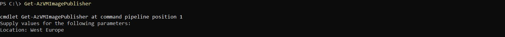
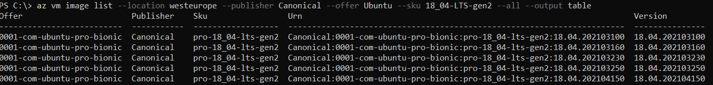

# Make the VM useful

I have a running VM.\
Not a bad thing, but does it have any practical application?

Not yet. I cannot even login. \
But it is time to change it.


# What I want to change

First - I want gain knowledge how to find OS image reference values \
Second - I want to be able to login to the VM \
Third - control azurerm virtual machines features 

# VM image

Let's assume that for the fist time in my life I am about to build the VM in Azure. 
Through the portal - easy thing to do. But with Terraform I need publisher, offer, sku. \
How to  **find** these information for my favorite operating system ? 

Let's try to find answer for this question.

And I would like to use PowerShell for that


### PowerShell

First I have to install Azure PowerShell \
There are two methods (at least I found 2 on > https://docs.microsoft.com/en-us/powershell/azure/new-azureps-module-az?view=azps-7.5.0). \
Installation method depends on which PS version is on the system which can be easily determined with following command

``` PowerShell
$PSVersionTable.PSVersion
```

I have preinstalled PowerShell v5.1, but, since DevOpsCamp PowerShell training is right around the corner, I decided to install v7.2

There is a complete manual how to do it
> https://docs.microsoft.com/en-us/powershell/scripting/whats-new/migrating-from-windows-powershell-51-to-powershell-7?view=powershell-7.2

And one more page - I want to use PowerShell inside Visual Studio Code
> https://docs.microsoft.com/en-us/powershell/scripting/dev-cross-plat/vscode/using-vscode?view=powershell-7.2


### AZ Module

Now finally I can install Azure PS module \
There is a manual how to do it on PowerShell 7.x 
> https://docs.microsoft.com/en-us/powershell/azure/install-az-ps?view=azps-7.5.0

Not a very complicated thing to do :smile: \
First command ensures that the execution policy is set properly
``` PowerShell
Set-ExecutionPolicy -ExecutionPolicy RemoteSigned -Scope CurrentUser
```

Second command to install module
``` PowerShell
Install-Module -Name Az -Scope CurrentUser -Repository PSGallery -Force
```

Now it is enough to type 
``` powershell
Get-InstalledModule
``` 
to see all the AZ-... modules installed.


## OS images with PowerShell

I thought : Finally ! Now with only few clicks I can list available images.

After a successful login to my account with
``` PowerShell
Connect-AzAccount 
```

I typed command to know all what I want to know
``` PowerShell
Get-AzVMImage
```

What a big disappointment :disappointed:


It seems that without few additional parameters (like name o the organization that crated image, name of the group of the images, instance of an offer) I cannot find image :disappointed:
Maybe I did something wrong with this, but ... there is the command documentation 
> https://docs.microsoft.com/en-us/powershell/module/az.compute/get-azvmimage?view=azps-7.5.0

I thought - don't give up. It has to be easy to find all those information. \
Let's start with the Publisher.
``` PowerShell
Get-AzVMImagePublisher
```
Nice surprise - PowerShell asked for a location and even allowed me to type it with space in the middle


and.... another disappointment \
list was a long one and did not allowed me to **easy find** required information \


## OS images with Azure CLI

I thought - well maybe it is time to take different approach. \
The Azure CLI.

Proper documentation is here
> https://docs.microsoft.com/en-us/azure/virtual-machines/linux/cli-ps-findimage

But will this allow me to **find** information ? 

Les't try to find a Windows server image

``` 
az vm image list --offer windows --all --output table
```

Success - maybe this list is a bit long but the image and all its information are there.
With few little tweaks to to limit the list:
```
az vm image list --offer windowsserver --sku 2012-r2 --all --output table
```
i found all the necessary information formatted like I need to use it in Terraform file.


For Ubuntu it would be like this
```
az vm image list --location westeurope --publisher Canonical --offer Ubuntu --sku 18_04-LTS-gen2 --all --output table
```


Finally ! \
List is short, has all the information in proper format. Now I can deploy whatever OS I want (of course if the image is available :wink:)


# Access the VM

I want to be able to login o the VM directly form my home computer. This means two things - VM needs public IP and traffic from the internet to the VM must be possible.


## Public IP

I need public IP. It will be allocated for me dynamically, but with use of output variable I will be able to find it

Public IP definition will be placed in network.tf

``` hcl
resource "azurerm_public_ip" "PublicIP" {
  name                = "${var.project-name}-${var.environment}-PubIP"
  location            = azurerm_resource_group.rg.location
  resource_group_name = azurerm_resource_group.rg.name
  allocation_method   = "Dynamic"
}
```

To access the IP value in the outputs.tf file I define variable 
``` hcl
output "public_ip_address" {
  value = azurerm_linux_virtual_machine.LVM.public_ip_address
  description = "Open this IP in a web browser to see your web page"
}
```

Now I will be able to display the IP value with
``` hcl
terraform output public_ip_address
```

## Login to VM

Now when I have public IP and a private key I can login to the VM
``` hcl
ssh -i ~/.ssh/azurekey adminuser@<public-IP-address>
```


# Results

Terraform apply finished like this, and I can login to the VM:


Once logged in I can e.g check if the VM OS version is proper (the one I so neatly chose)
``` 
lsb_release -a
```


When logged to portal I can see my resource group


The LVM has assigned the public IP


Terraform files are available here:
> https://github.com/cloudZeroToHero/DevOpsCamp-Terraform-Azure/tree/main/Code/04-UsefulSingleVM


