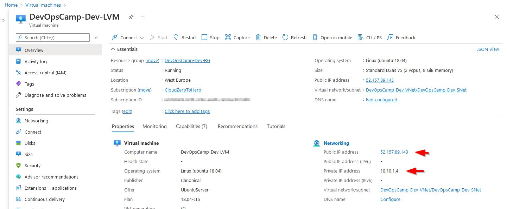
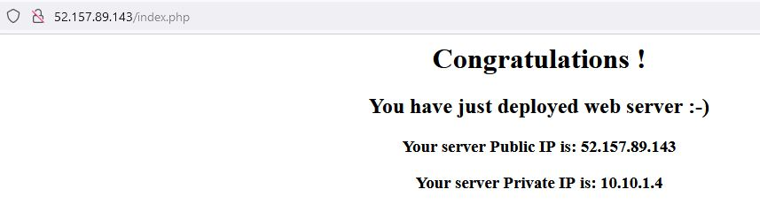

# How to install Apache 

A working and accessible VM is a nice thing, but a web server is even better :smile:

I don't want to instal Apache each time I deploy w VM. \
I will use the custom data definition to deploy necessary packages each time the VM will be deployed

## Custom data 

The definition itself is a single line
```
custom_data = filebase64("custom_data.sh")
```

it points to the script file located in the same catalog where all other files exists.


## Security rule

Additional security rule is necessary to access deployed server on port 80
``` hcl
  security_rule {
    name                       = "WEB"
    priority                   = 151 # range from 100 to 4096, lower nunber = higher priority
    direction                  = "Inbound"
    access                     = "Allow"
    protocol                   = "Tcp"
    source_port_range          = "*"
    destination_port_range     = "80"
    source_address_prefix      = "*"
    destination_address_prefix = "*"
  }
  ```

## Web pages

Few additional files will allow me to test if the deployment and provisioning were successful

phpinfo.php is just a file which displays the phpinfo page

index.php is a simple page that will display private and public IP address of the host

# Results

Deployed VM has following IP addresses 


Under the public IP address I found (as expected) the default Apache web page


The index.php was a bit more useful - it confirmed the public and private IP



As always source files can be found in the repo
> https://github.com/cloudZeroToHero/DevOpsCamp-Terraform-Azure/tree/main/Code/05-WebServer

