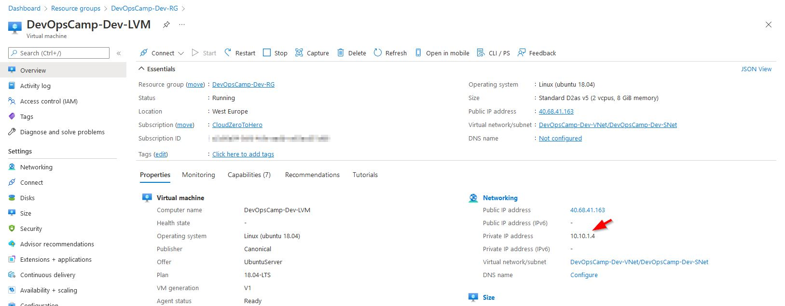

# What can be done better of different

There is a few thing that can be done better

## NSG

First is a simple change - Microsoft recommendation is to attach the Network Security group rather to individual subnet not to individual network interfaces. Thus instead of **azurerm_network_interface_security_group_association** resource I will use **azurerm_subnet_network_security_group_association**

Security rules can be defined in-line within the Network Security Group resource or as standalone. The latter approach seems to be more flexible. It will be much easier to add or remove rules from security group.

Another recommendation is to use different virtual network address spaces in different region - just in case in future someone would like to peer those vnet

I re-wrote variables.tf and network.tf to reflect these recommendations


## SSH key

I have created the SSH key before VM deployment. What If would like to do it during deployment just like I can do that when I create VM through the Portal?

I found interesting tutorial which uses this method
> https://docs.microsoft.com/en-us/azure/developer/terraform/create-linux-virtual-machine-with-infrastructure

An resource to create SSH key has following definition
``` hcl
resource "tls_private_key" "SSHKey" {
  algorithm = "RSA"
  rsa_bits  = 4096
}
```
and will be placed in infrastructure.tf file

Now in VM definition instead of function to call for a key from file
``` hcl
  admin_ssh_key {
    username   = "adminuser"
    public_key = file("~/.ssh/azurekey.pub")
  }
```

SSH key will reference the resource
``` hcl
  admin_ssh_key {
    username   = "adminuser"
    public_key = tls_private_key.SSHKey.public_key_openssh
  }
```

It works (please see below), but I think - for now (till I introduce some kind of password vault) I will stick with the pre-created SSH key

# Results

## Network

As for the VMs the only easy to find result was a change in private IP number \
Dev VM have IP from 10.10.x.x virtual network (and subnet in this network)


while Prod VM has a IP number form 10.20.x.x range


## Access to the VM

As for the dynamically created SSH key....\
Well - according to the manual it should be possible to write the private key to file with 
``` hcl
terraform output -raw tls_private_key > id_rsa
```
and access VM with 
``` hcl
ssh -i id_rsa adminuser@<public_ip_address>
```

But in reality I got following error 


It seems that the only location where the key can be kept (at least on Windows system) is .ssh subfolder in user home directory. Moreover - the path to the .ssh folder has to be  the "windows-style" not ~/.ssh (this worked when I wrote key, but not when wanted to connect to VM)

Finally I used this to access VM
``` hcl
terraform output public_ip_address
```
``` hcl
terraform output -raw tls_private_key > c:\users\cloudzerotohero\.ssh\newkey
```
``` hcl
ssh -i c:\users\cloudzerotohero\.ssh\newkey adminuser@40.112.65.45
```