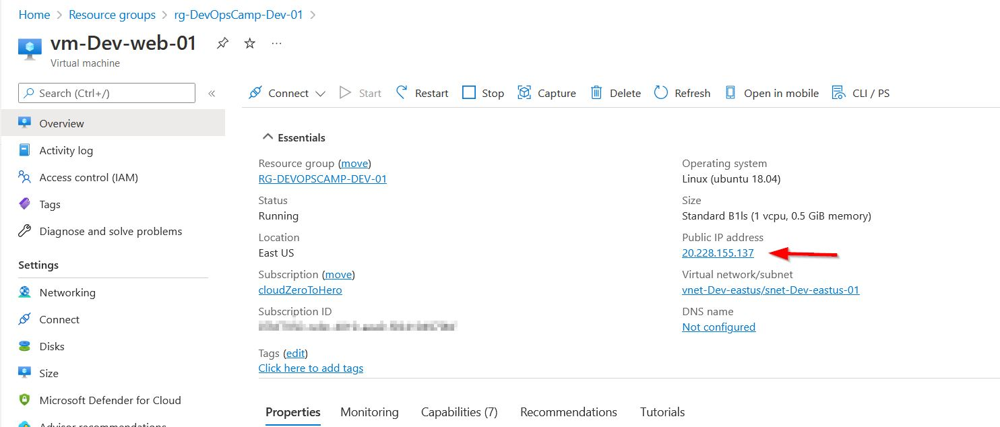

# CAF naming convention

Until now I did not put a decent attention to resources names. This is fine for a demo project like this, but in other hand - why not give it a try ? :smile:

On the Microsoft documentation pages I found guidance on how to create a naming convention for resources in Azure:

> https://docs.microsoft.com/en-us/azure/cloud-adoption-framework/ready/azure-best-practices/resource-naming

and a list of abbreviations for all the resource types

> https://docs.microsoft.com/en-us/azure/cloud-adoption-framework/ready/azure-best-practices/resource-abbreviations

Although it is tempting to rename all resources to introduce full compliance with CAF naming convention, I will stick for now with start the resource names with the proper abbreviations. Later on I plan to use (or rather experiment :wink:) with AzureCAF provider described there

> https://registry.terraform.io/providers/aztfmod/azurecaf/latest/docs

And it seems - it is still OK

I was able to deploy VM 

with a running Apache 

Source code is available under
> https://github.com/cloudZeroToHero/DevOpsCamp-Terraform-Azure/tree/main/Code/07-CAFNaming