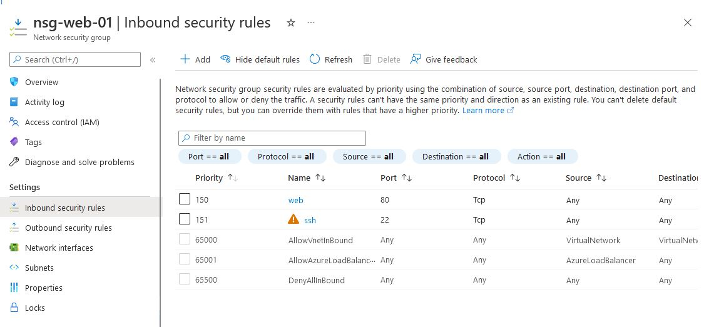

# For-each loop

Fist time I wrote inbound rules I though it is a waste of time to repeat the same segment of code over and over gain. I thought there should be a better way to do it. 

And it turns out - there is. A for-each loop.

To use it I had first to define ports I want to be open. Of course I want to have access on port 80 (just to see if Apache nad PHP were installed), but also on port 22 to be able to login (I know, but this is only test environment which exist for a few minutes)

Variable declaration looks like this:

``` hcl
variable "allowedPorts" {
  default =[
    {  # Web
      name="web"
      destPort="80"
      priority = 150
    },

    {  #SSH
      name="ssh"
      destPort="22"
      priority = 151
    }
  ]
}
```

Now I have to loop through this list and for each map crate one inbound rule. 

This looks like this:
``` hcl
resource "azurerm_network_security_group" "SecGr" {
  name                = "nsg-web-01"
  location            = azurerm_resource_group.rg.location
  resource_group_name = azurerm_resource_group.rg.name

  dynamic security_rule {
    for_each = var.allowedPorts
    content {
      name                       = lookup(security_rule.value, "name")
      priority                   = lookup(security_rule.value, "priority") # range from 100 to 4096, lower nunber = higher priority
      direction                  = "Inbound"
      access                     = "Allow"
      protocol                   = "Tcp"
      source_port_range          = "*"
      destination_port_range     = lookup(security_rule.value, "destPort")
      source_address_prefix      = "*"
      destination_address_prefix = "*"
    }
  }

}
```

As a result I have shorter, more manageable code and Network Security Group with required rules


Complete code is available here:
> https://github.com/cloudZeroToHero/DevOpsCamp-Terraform-Azure/tree/main/Code/08-Loops
